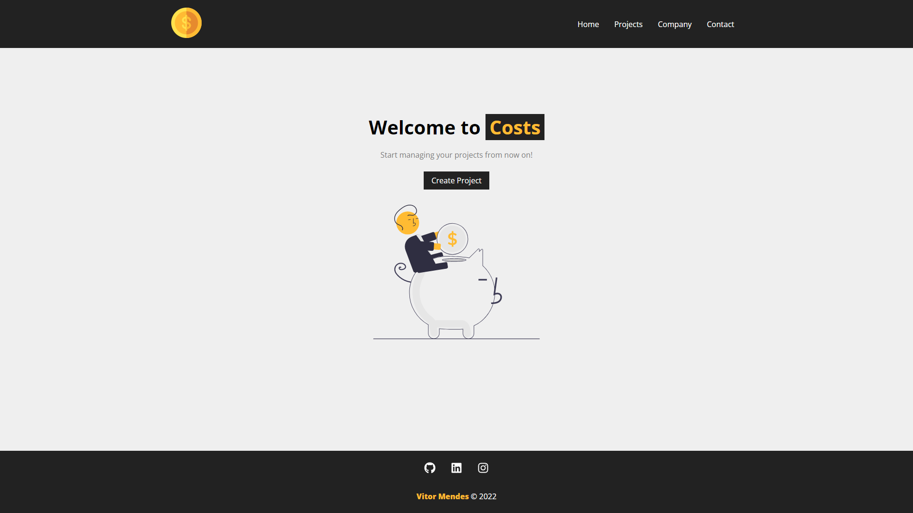
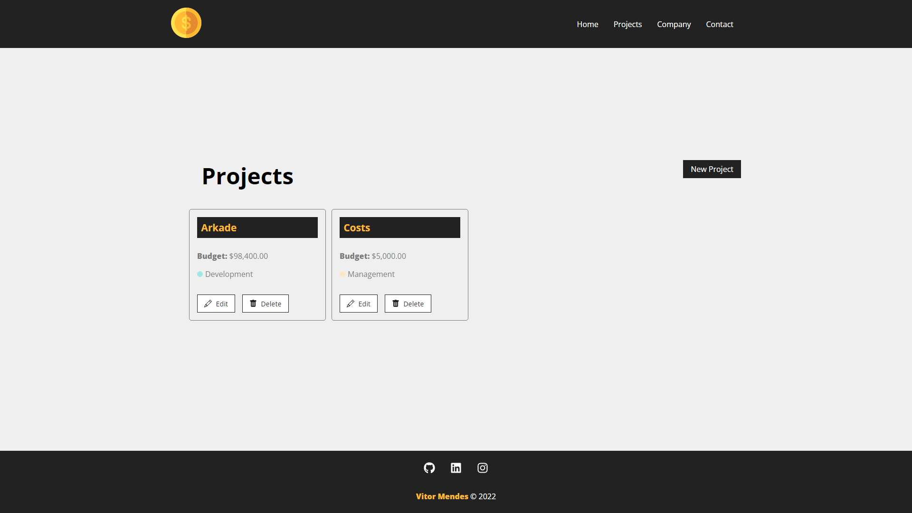

# **Costs**

#

Costs é um projeto de gerenciamento de projetos, abusivamente original e útil, que estou usando para me introduzir ao ambiente React.

#

Costs is a project management project, abusively original and useful, that I'm using to introduce myself into the React environment.

#

> 
> **`Running Tutorial`**
>> 
>>1 - You will need to open **2 terminals** 
>>2 - At projects folder, open a terminal and type:
>>
>>>**`npm run backend`**
>>
>>3 - Open another terminal and type:
>>>**`npm start`**
>>
>>4 - Now, just open in your browser at **URL**:
>>>**`http://localhost:3000/`**
>>
>> 

#

**
<u>Acknowledgements</u>
**

- [Matheus Battisti's Course](https://www.youtube.com/watch?v=FXqX7oof0I4&ab_channel=MatheusBattisti-HoradeCodar)
- [Matheus Battisti's Profile](https://github.com/matheusbattisti)

  

##

  

##

  

##

  

 

#

##

> 
Tecnologias

  
  
  
  

 

#

   

 
   

